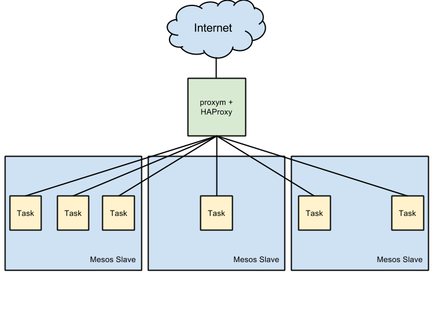
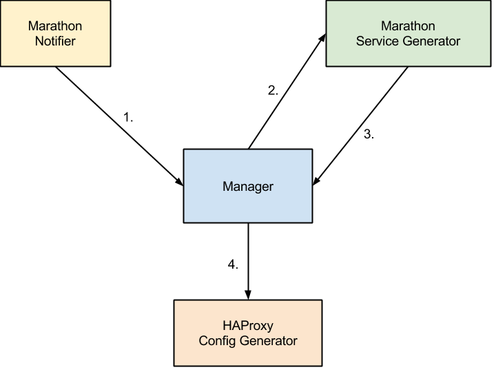

# proxym

`proxym` is short for proxy manager.
It generates configuration file(s) of a reverse proxy whenever something inside your system changes.

## Purpose

The original purpose of `proxym` is to use HAProxy as a reverse proxy for applications managed by
[Marathon](https://github.com/mesosphere/marathon) and running on [Apache Mesos](http://mesos.apache.org/) with
minimal downtime in case of a deployment.

Note that this is not so much about service discovery inside a Mesos cluster but about connecting services running in
the cluster to the outside world.



However, its design makes it easy to integrate with systems other than [Marathon](https://github.com/mesosphere/marathon).

## Design

The `proxym` executable itself is meant to run alongside a process of a reverse proxy (e.g. HAProxy), instructing it
to reload its configuration whenever `proxym` recognizes a change in an outside system.

It takes a modular approach by dividing responsibility into three parts:
[Notifiers](http://godoc.org/github.com/wndhydrnt/proxym/types#Notifier),
[ServiceGenerators](http://godoc.org/github.com/wndhydrnt/proxym/types#ServiceGenerator) and
[ConfigGenerators](http://godoc.org/github.com/wndhydrnt/proxym/types#ConfigGenerator).



1. The `Marathon Notifier` has registered a callback via the [Marathon Event Bus](https://mesosphere.github.io/marathon/docs/event-bus.html)
   and receives an event in case an application is deployed or scaled. It notifies the `Manager` of that change.
2. The `Manager` asks all `Service Generators` for their available [Service](http://godoc.org/github.com/wndhydrnt/proxym/types#Service)s.
   In this case only the `Marathon Service Generator` is registered. It queries
   `/v2/apps` and `/v2/tasks` of a Marathon server, generates a list of
   `Service`s and returns it back to the `Manager`.
3. The `Manager` calls all  `Annotator`s which enhance `Service`s with
   additional configuration.
4. The `Manager` takes the list of `Service`s and instructs the
   `HAProxy Config Generator` to create the configuration file for `haproxy` and
   restart it if the file has changed.

## HTTP Server

proxym provides a HTTP server where modules can [register](http://godoc.org/github.com/wndhydrnt/proxym/manager#RegisterHttpHandler)
endpoints to expose an external API.
The listen address of the server is configured by setting the environment
variable `PROXYM_LISTEN_ADDRESS`.

## Modules

### File

A Notifier that watches `PROXYM_FILE_CONFIGS_PATH` for changes.

A ServiceGenerator that reads configuration from files. Configuration files
are written in JSON and are a serialized representation of
[types.Service](http://godoc.org/github.com/wndhydrnt/proxym/types#Service).

Environment variables:

Name | Description | Required | Default
---- | ----------- | -------- | -------
PROXYM_FILE_CONFIGS_PATH | The base directory under which configuration files are stored. | yes | None
PROXYM_FILE_ENABLED | Enable the module. | no | 0

```json
# <PROXYM_FILE_CONFIGS_PATH>/myapp.json
{
  "ApplicationProtocol": "http",
  "Config": "option forwardfor",
  "Domains": ["example.org"],
  "Hosts": [
    {
      "Ip": "1.2.3.4",
      "Port": 56789
    }
  ],
  "Id": "file_example",
  "Port": 1234,
  "TransportProtocol": "tcp"
}
```

The value of [types.Service.Source](http://godoc.org/github.com/wndhydrnt/proxym/types#Service)
of services generated by the ServiceGenerator is `File`.

### [Hipache](https://github.com/hipache/hipache)

A ConfigGenerator that dynamically updates VHOSTs of Hipache.

Environment variables:

Name | Description | Required | Default
---- | ----------- | -------- | -------
PROXYM_HIPACHE_DRIVER | The driver to use to write dynamic VHOST configuration. Currently only `redis` is supported. | no | `redis`
PROXYM_HIPACHE_ENABLED | Enable this module. | no | 0
PROXYM_HIPACHE_REDIS_ADDRESS | The address used by the redis driver to connect to the server, e.g. `127.0.0.1:6379`. | yes | None

### Proxy

A ConfigGenerator that takes a list of [Services](http://godoc.org/github.com/wndhydrnt/proxym/types#Service)
and a template, writes the result to a file and issues a command to restart/reload a proxy process.

Environment variables:

Name | Description | Required | Default
---- | ----------- | -------- | -------
PROXYM_PROXY_CHECK_COMMAND | Validate the generated configuration file before attempting to restart the proxy, e.g. `nginx -t -c ~/mynginx.conf` | no | None
PROXYM_PROXY_CONFIG_FILE_PATH | An absolute path where the generated config file will be stored, e.g. `/etc/nginx/nginx.conf` | yes | None
PROXYM_PROXY_ENABLED | Enable this module. | no | 0
PROXYM_PROXY_RELOAD_COMMAND | The command to issue if the configuration file has changed, e.g. `nginx -s reload`. The reload command is wrapped with `/bin/bash -c` | yes | None
PROXYM_PROXY_TEMPLATE_PATH | Path to the template used to generate the configuration file of the proxy, e.g. `/etc/nginx/nginx.conf.tpl` | yes | None

#### Configuration File Template

The data passed to the template is a list of `types.Service` structs.
[Functions](http://godoc.org/github.com/spf13/hugo/tpl) of the [Hugo templating engine](http://gohugo.io/) are available in the template.
Take a look at this example configuration files of [HAProxy](./docs/haproxy-example.cfg) and [nginx](./docs/nginx-example.conf).

### Marathon

Provides a Notifier that registers a callback with the [event bus](https://mesosphere.github.io/marathon/docs/event-bus.html)
of Marathon and triggers a refresh whenever it receives a `status_update_event`.

A `ServiceGenerator` queries Marathon for [applications](https://mesosphere.github.io/marathon/docs/rest-api.html#get-/v2/apps) and
[tasks](https://mesosphere.github.io/marathon/docs/rest-api.html#get-/v2/tasks).

Environment variables:

Name | Description | Required | Default
---- | ----------- | -------- | -------
PROXYM_MARATHON_SERVERS | A list of Marathon servers separated by commas. Format '\<IP\>:\<PORT\>,\<IP\>:\<PORT\>,...' | yes | None

The value of [types.Service.Source](http://godoc.org/github.com/wndhydrnt/proxym/types#Service)
of services generated by the ServiceGenerator is `Marathon`.

### Mesos Master

A Notifier that constantly polls Mesos masters, extracts the current leader and
triggers a refresh in case the leader has changed.

A ServiceGenerator that queries Mesos masters, extracts the current leader and
emits a Service.

Environment variables:

Name | Description | Required | Default
---- | ----------- | -------- | -------
PROXYM_MESOS_MASTER_DOMAIN | The value to set as the `Domain` field in the [types.Service](http://godoc.org/github.com/wndhydrnt/proxym/types#Service) struct. | yes | None
PROXYM_MESOS_MASTER_ENABLED | Enable the module. | no | 0
PROXYM_MESOS_MASTER_MASTERS | Addresses of Mesos master separated by commas: `http://master1:5050,http://master2:5050,...` | yes | None
PROXYM_MESOS_MASTER_POLL_INTERVAL | Time between two calls to one of the Mesos masters (in seconds). | no | 10

The value of [types.Service.Source](http://godoc.org/github.com/wndhydrnt/proxym/types#Service)
of services generated by the ServiceGenerator is `Mesos Master`.

### Signal

Triggers a refresh whenever the process receives a `SIGUSR1` signal. The signal
can be send by software such as Ansible, Chef or Puppet.

### Stdout

A ConfigGenerator that prints received services to `stdout`. Useful for
debugging.

Name | Description | Required | Default
---- | ----------- | -------- | -------
PROXYM_STDOUT_ENABLED | Enable this module. | no | 0

## Logging

The [log](./log/log.go) package defines the loggers `AppLog`, which writes to
`STDOUT`, and `ErrorLog`, which writes `STDERR`.

The level of `AppLog` is configurable while the level of `ErrorLog` is `ERROR`.

Environment variables:

Name | Required | Default
---- | -------- | -------
PROXYM_LOG_APPLOG_LEVEL | no | `INFO`
PROXYM_LOG_FORMAT | no | `%{time:02.01.2006 15:04:05} [%{level}] %{longfunc}: %{message}`

All available format options can be found in the [docs](http://godoc.org/github.com/op/go-logging#NewStringFormatter)
of [go-logging](https://github.com/op/go-logging).
