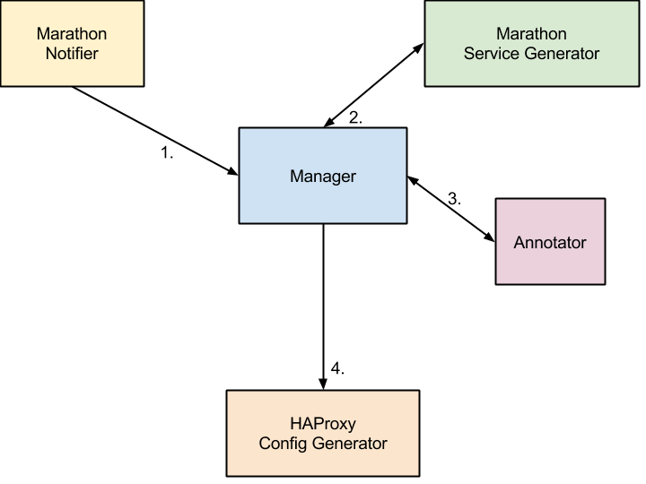

# proxym

`proxym` is short for proxy manager.
It generates configuration file(s) of a reverse proxy whenever something inside your system changes.

## Purpose

The original purpose of `proxym` is to use HAProxy as a reverse proxy for applications managed by
[Marathon](https://github.com/mesosphere/marathon) and running on [Apache Mesos](http://mesos.apache.org/) with
minimal downtime in case of a deployment.

Note that this is not so much about service discovery inside a Mesos cluster but about connecting services running in
the cluster to the outside world.


However, its design makes it easy to integrate with systems other than [Marathon](https://github.com/mesosphere/marathon).

## Design

The `proxym` executable itself is meant to run alongside a process of a reverse proxy (e.g. HAProxy), instructing it
to reload its configuration whenever `proxym` recognizes a change in an outside system.

It takes a modular approach by dividing responsibility into three parts:
[Notifiers](http://godoc.org/github.com/wndhydrnt/proxym/types#Notifier),
[ServiceGenerators](http://godoc.org/github.com/wndhydrnt/proxym/types#ServiceGenerator) and
[ConfigGenerators](http://godoc.org/github.com/wndhydrnt/proxym/types#ConfigGenerator).



1. The `Marathon Notifier` has registered a callback via the [Marathon Event Bus](https://mesosphere.github.io/marathon/docs/event-bus.html)
   and receives an event in case an application is deployed or scaled. It notifies the `Manager` of that change.
2. The `Manager` asks all `Service Generators` for their available [Service](http://godoc.org/github.com/wndhydrnt/proxym/types#Service)s.
   In this case only the `Marathon Service Generator` is registered.
3. The `Marathon Service Generator` queries `/v2/apps` and `/v2/tasks`, generates a list of `Service`s and returns it back to the `Manager`.
4. The `Manager` takes the list of `Service`s and instructs the `HAProxy Config Generator` to create the configuration file of
   `haproxy` and restart it if the file has changed.

## Modules

### File

Defines a ServiceGenerator that reads configuration from files.
Configuration files are written in JSON.

Environment variables:

Name | Description | Required | Default
---- | ----------- | -------- | -------
PROXYM_FILE_CONFIGS_PATH | The base directory under which configuration files are stored. | yes | None
PROXYM_FILE_ENABLED | Enable the module. | no | 0

```json
# <PROXYM_FILE_CONFIGS_PATH>/myapp.json
{
  "domain": "myapp.example.com",
  "hosts": [
    {"ip": "10.1.1.1", "port": 8080},
    {"ip": "10.1.1.2", "port": 8080}
  ],
  "id": "/myapp",
  "port": 8080,
  "protocol": "tcp"
}
```

The value of `Service.Source` of services generated by this `ServiceGenerator` is `File`.

### HAProxy

A ConfigGenerator that takes a list of [Services](http://godoc.org/github.com/wndhydrnt/proxym/types#Service) and writes
the configuration file of HAProxy, restarting HAProxy in case the configuration has changed.

Environment variables:

Name | Description | Required | Default
---- | ----------- | -------- | -------
PROXYM_HAPROXY_BINARY_PATH | The absolute path to the binary of HAProxy. | yes | None
PROXYM_HAPROXY_CONFIG_FILE_PATH | An absolute path where the generated config file will be stored. This file is passed to the binary of HAProxy. | yes | None
PROXYM_HAPROXY_ENABLED | Enable this module. | no | 0
PROXYM_HAPROXY_SETTINGS_PATH | Path to a directory where additional configuration files of services are stored. | yes | None
PROXYM_HAPROXY_PID_PATH | The absolute path to the PIDFILE of `haproxy`. | yes | None

### Marathon

Provides a Notifier that registers a callback with the [event bus](https://mesosphere.github.io/marathon/docs/event-bus.html)
of Marathon and triggers a refresh whenever it receives a `status_update_event`.

A `ServiceGenerator` queries Marathon for [applications](https://mesosphere.github.io/marathon/docs/rest-api.html#get-/v2/apps) and
[tasks](https://mesosphere.github.io/marathon/docs/rest-api.html#get-/v2/tasks).

Environment variables:

Name | Description | Required | Default
---- | ----------- | -------- | -------
PROXYM_MARATHON_CALLBACK_HOST | The IP the Marathon event receiver uses to bind to. | yes | None
PROXYM_MARATHON_CALLBACK_PORT | The port the Marathon event receiver uses to bind to. | yes | None
PROXYM_MARATHON_CALLBACK_ENDPOINT | The path to the resource which gets registered with Marathon. | no | `/callback`
PROXYM_MARATHON_SERVERS | A list of Marathon servers separated by commas. Format '\<IP\>:\<PORT\>,\<IP\>:\<PORT\>,...' | yes | None

The value of `Service.Source` of services generated by the `ServiceGenerator` is `Marathon`.

### Mesos Master

A Notifier that constantly polls Mesos masters, extracts the current leader and triggers a refresh in case the leader
has changed.

A ServiceGenerator that queries Mesos masters, extracts the current leader and emits a Service.

Environment variables:

Name | Description | Required | Default
---- | ----------- | -------- | -------
PROXYM_MESOS_MASTER_DOMAIN | The value to set as the `Domain` field in the [Service](http://godoc.org/github.com/wndhydrnt/proxym/types#Service) struct. | yes | None
PROXYM_MESOS_MASTER_ENABLED | Enable the module. | no | 0
PROXYM_MESOS_MASTER_MASTERS | Addresses of Mesos master separated by commas: `http://master1:5050,http://master2:5050,...` | yes | None
PROXYM_MESOS_MASTER_POLL_INTERVAL | Time between two calls to one of the Mesos masters (in seconds). | no | 10

The value of `Service.Source` of services generated by the `ServiceGenerator` is `Mesos Master`.

### Signal

Triggers a refresh whenever the process receives a `SIGUSR1` signal. The signal can be send by software such as Ansible,
Chef or Puppet.

## Logging

The [log](./log/log.go) package defines the loggers `AppLog`, which writes to `STDOUT`, and `ErrorLog`, which writes
`STDERR`.

The level of `AppLog` is configurable while the level of `ErrorLog` is `ERROR`.

Environment variables:

Name | Required | Default
---- | -------- | -------
PROXYM_LOG_APPLOG_LEVEL | no | `INFO`
PROXYM_LOG_FORMAT | no | `%{time:02.01.2006 15:04:05} [%{level}] %{longfunc}: %{message}`

All available format options can be found in the [docs](http://godoc.org/github.com/op/go-logging#NewStringFormatter)
of [go-logging](https://github.com/op/go-logging).
